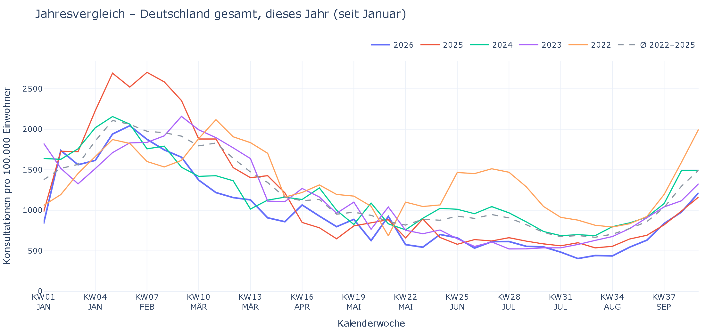
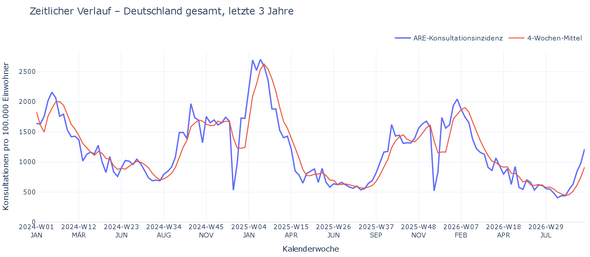
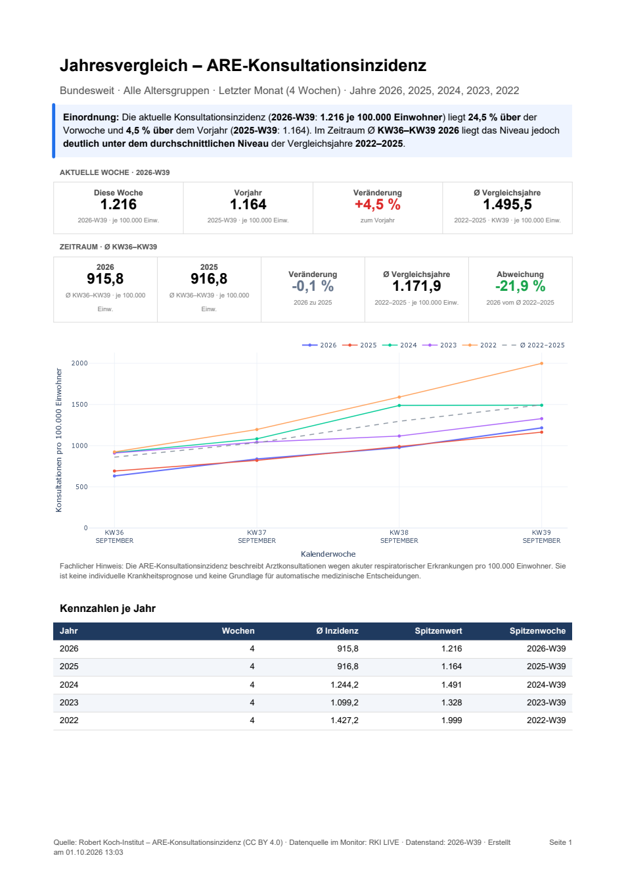
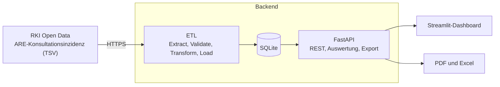

<div align="center">

# RKI Health Data Monitor

**Wöchentliche Atemwegs-Daten des Robert Koch-Instituts, importiert, geprüft und als interaktives Dashboard ausgewertet.**

*Weekly acute respiratory illness (ARE) consultation incidence from Germany's RKI, imported, validated and analysed in an interactive dashboard with PDF and Excel reports.*

<br>


[Highlights](#highlights) | [Schnellstart](#schnellstart) | [Online bereitstellen](#online-bereitstellen) | [Architektur](#architektur) | [REST API](#rest-api) | [Tests](#tests) | [Datenquelle und Lizenz](#datenquelle-und-lizenz)

<br>



</div>

---

## Highlights

| | |
|---|---|
| **Zeitlicher Verlauf** | Entwicklung der Konsultationsinzidenz je Zeitraum, von der letzten Woche bis zu 5 Jahren, mit 4-Wochen-Mittel. |
| **Jahresvergleich** | Dieselben Kalenderwochen mehrerer Jahre übereinander, inklusive Durchschnitt der Vergleichsjahre, Vorjahr und Vorwoche. |
| **Einordnung in Worten** | Kurzfassung in einer Zeile (zum Beispiel: 41,3 % über der Vorwoche, deutlich unter dem Durchschnitt 2023 bis 2025) und eine ausführliche Erklärung per Klick. |
| **PDF- und Excel-Export** | Jedes Diagramm mit Kennzahlen, Einordnung und Datentabelle. Das PDF enthält das Dashboard-Diagramm, die Excel-Datei ein editierbares Diagramm. |
| **Datenverfügbarkeit** | Hinweise, ab wann das RKI Daten je Bundesland veröffentlicht (Bundesländer erst ab 2022). Unvollständige Jahre fließen nicht in Durchschnitte ein. |
| **RKI-Quelle offline** | Die GitHub-Seite des Datensatzes (README, Lizenz, Metadaten, Dokumentation) als Offline-Ansicht, auch ohne Internet. |
| **Glossar mit Live-Suche** | Begriffe und Abkürzungen. Treffer im Begriff erscheinen vor Treffern in der Beschreibung. |
| **Zuverlässiger Import** | Schema- und Datenvalidierung, UPSERT für Nachmeldungen, SHA-256-Änderungserkennung und ETL-Audit-Trail. |

## Einblicke

<table>
  <tr>
    <td width="50%" valign="top"><b>Zeitlicher Verlauf</b> (letzte 3 Jahre)<br></td>
    <td width="50%" valign="top"><b>PDF-Bericht</b> mit Kennzahlen, Diagramm und Datentabelle<br></td>
  </tr>
</table>

Kennzahlen erscheinen als Karten mit kurzem Titel, großem Wert und kleiner Zeile für Zeitraum und Einheit (*je 100.000 Einw.*). Veränderungen sind farbcodiert: Anstiege rot, Rückgänge grün.

## Schnellstart

**Voraussetzung:** Python **3.10** (der Code ist bewusst ohne `StrEnum` geschrieben und für 3.10 getestet).

```powershell
# 1. Repository holen und Umgebung einrichten
git clone https://github.com/pangeawelt/rki-health-data-monitor.git
cd rki-health-data-monitor
py -3.10 -m venv .venv
.\.venv\Scripts\Activate.ps1
python -m pip install --upgrade pip
python -m pip install -r requirements.txt
Copy-Item .env.example .env
```

<details>
<summary>macOS / Linux</summary>

```bash
git clone https://github.com/pangeawelt/rki-health-data-monitor.git
cd rki-health-data-monitor
python3.10 -m venv .venv
source .venv/bin/activate
python -m pip install --upgrade pip
python -m pip install -r requirements.txt
cp .env.example .env
```

</details>

```powershell
# 2. API starten (Terminal 1): Swagger unter http://127.0.0.1:8000/docs
python -m uvicorn src.api.app:app --host 127.0.0.1 --port 8000

# 3. Dashboard starten (Terminal 2): http://localhost:8501
streamlit run dashboard/app.py
```

**4. Daten:** Die Datenbank ist im Repository bewusst **leer**, es gibt keine vorbefüllten oder synthetischen Dashboard-Daten. Beim ersten Start einer leeren Datenbank lädt die API die aktuellen RKI-Daten automatisch (Internet erforderlich). Aktualisieren lässt sich jederzeit im Dashboard über **"Aktuelle RKI-Daten laden"** oder per Kommandozeile:

```powershell
python -m src.cli refresh
```

Nach dem ersten Import liegen alle Daten in `data/rki_monitor.db`, das Dashboard arbeitet danach auch ohne Internet.

## Online bereitstellen

Das Dashboard läuft auch ohne eigenen Server, zum Beispiel auf der kostenlosen [Streamlit Community Cloud](https://share.streamlit.io):

1. Auf share.streamlit.io mit GitHub anmelden und **Create app** wählen.
2. Repository, Branch `main` und als Hauptdatei **`dashboard/app.py`** angeben.
3. Unter **Advanced settings** die **Python-Version 3.12** wählen (3.11 und 3.10 funktionieren ebenfalls). Neuere Versionen wie 3.14 sind nicht geeignet, weil es dort für die festgelegten Paketversionen keine fertigen Pakete gibt.
4. **Deploy** wählen. Secrets sind nicht nötig.

Beim Start bringt das Dashboard die API im selben Prozess hoch (`EMBEDDED_API`) und lädt bei leerer Datenbank die aktuellen RKI-Daten (`AUTO_IMPORT_IF_EMPTY`). Der erste Aufruf dauert dadurch einige Sekunden. Der Speicher der kostenlosen Stufe ist flüchtig: Nach einem Neustart wird die Datenbank neu aufgebaut. Steht auf dem Host keine Browser-Engine für Kaleido bereit, entsteht das PDF ohne Diagrammbild (Kennzahlen und Datentabelle bleiben vollständig); der Excel-Export ist nicht betroffen.

## Bedienung

| Filter | Wirkung |
|---|---|
| **Bundesland** und **Altersgruppe** | Region und Altersgruppe aller Auswertungen |
| **Zeitraum** | Letzte Woche (mit Vorwoche), Letzter Monat (4 Wochen), Letzte 3 Monate (13 Wochen), Dieses Jahr (ab Januar), Letzte 3 Jahre, Letzte 5 Jahre. Gilt für **beide** Diagramme. |
| **Jahre** | Welche Jahre im Jahresvergleich übereinandergelegt werden (bis zu 5) |

Über jedem Diagramm stehen die **Kurzfassung**, der Button **Einordnung** (ausführlicher Text), **Hinweise** (Datenverfügbarkeit, nur wenn vorhanden) sowie **PDF** und **Excel**. Die Kalenderwochen-Achse zeigt unter jeder Woche den Monat in Großbuchstaben (zum Beispiel *KW36 / SEPTEMBER*).

## Architektur



- **Schichtentrennung:** UI, HTTP API, Service, DB. Das Dashboard greift nie direkt auf SQLite zu.
- **ETL:** Erst nach erfolgreicher Validierung wird geschrieben. Nachmeldungen aktualisieren bestehende Wochen (UPSERT), unveränderte Quelldateien werden per SHA-256 erkannt (`NO_CHANGE`).
- **Auswertung:** Explizites SQL mit Window Functions (`LAG`, `AVG OVER`) für Verlauf und gleitenden Durchschnitt. Der Jahresvergleich arbeitet auf denselben ISO-Kalenderwochen.
- **Berichte aus etablierten Bibliotheken:** Das Diagramm ist *dieselbe* Plotly-Figur wie im Dashboard (Kaleido-Bildexport), das PDF-Layout kommt von ReportLab, Excel von pandas und XlsxWriter.

## REST API

Interaktive Dokumentation (Swagger/OpenAPI): `http://127.0.0.1:8000/docs`

| Methode | Endpoint | Zweck |
|---|---|---|
| `GET` | `/health` | Healthcheck |
| `POST` | `/api/refresh` | Aktuelle RKI-Daten abrufen und SQLite aktualisieren |
| `GET` | `/api/status` | ETL- und Datenstatus |
| `GET` | `/api/regions`, `/api/age-groups?region=...` | Verfügbare Regionen und Altersgruppen |
| `GET` | `/api/periods`, `/api/years?region=...` | Zeiträume und Jahre mit Daten |
| `GET` | `/api/coverage?region=...` | Ab wann das RKI Daten für die Region veröffentlicht |
| `GET` | `/api/incidence?region=...&period=month` | Zeitreihe und Kennzahlen |
| `GET` | `/api/incidence/compare?region=...&period=month&years=2026&years=2025` | Jahresvergleich |
| `GET` | `/api/incidence/export?...&format=pdf` oder `xlsx` | Verlauf als PDF oder Excel |
| `GET` | `/api/incidence/compare/export?...&format=pdf` oder `xlsx` | Jahresvergleich als PDF oder Excel |

```bash
curl "http://127.0.0.1:8000/api/incidence?region=Baden-Wuerttemberg&age_group=00%2B&period=month"
```

Das `+` in `00+` muss in URLs als `%2B` kodiert werden.

## Projektstruktur

```text
rki-health-data-monitor/
  src/
    api/            FastAPI (Endpunkte, Schemas)
    core/           Konfiguration, Konstanten, Zeiträume, Kalenderwochen
    db/             SQLAlchemy-Engine und -Modelle
    etl/            Extract, Validate, Transform, Load, Pipeline, Quellkopie
    services/
      analytics.py  Verlauf, Jahresvergleich, Datenverfügbarkeit (SQL)
      export/       Berichte: Modell, Einordnung, Diagramm, PDF, Excel
    cli.py          Administration (refresh, status, reset-db, ...)
  dashboard/        Streamlit: Seiten, Karten, Toolbar, Glossar
  data/quelle/      Offline-Kopie der RKI-GitHub-Seite
  sql/              Schema-Referenz und Beispiel-Abfragen
  tests/            pytest
  assets/           Bilder für dieses README
  requirements.txt, pyproject.toml, .env.example, LICENSE
```

## Konfiguration

Werte stehen in `.env` (Vorlage: `.env.example`) und werden mit `pydantic-settings` geladen. Feste Fachregeln (Spalten, Altersgruppen, Zeiträume) liegen bewusst im Code (`src/core/`), nicht in der Umgebung.

| Variable | Standard | Bedeutung |
|---|---|---|
| `DATABASE_PATH` | `./data/rki_monitor.db` | SQLite-Datei |
| `API_BASE_URL` | `http://127.0.0.1:8000` | Adresse der API für das Dashboard |
| `RKI_DATA_URL` | RKI-Rohdatei auf GitHub | Quelle des Imports |
| `SOURCE_COPY_DIR` | `./data/quelle/ARE-Konsultationsinzidenz` | Offline-Kopie der Quellseite |
| `EMBEDDED_API` | `true` | Das Dashboard startet die API im eigenen Prozess, wenn unter `API_BASE_URL` (lokale Adresse) keine läuft |
| `AUTO_IMPORT_IF_EMPTY` | `true` | Leere Datenbank beim API-Start automatisch aus der RKI-Quelle füllen |
| `HTTP_TIMEOUT_SECONDS` | `60` | Timeout des Downloads |
| `APP_AUTHOR` | *(leer)* | Optionaler Name in der Fußzeile des Dashboards |
| `LOG_LEVEL` | `INFO` | Log-Stufe |

## CLI

```powershell
python -m src.cli refresh                # aktuelle RKI-Daten laden (--force erzwingt ein vollständiges UPSERT)
python -m src.cli status                 # Daten- und ETL-Status
python -m src.cli update-source-copy     # Offline-Kopie der GitHub-Seite aktualisieren (Internet erforderlich)
python -m src.cli reset-db --yes         # lokale Datenbank zurücksetzen
```

## Tests

```powershell
pytest
```

Die Tests laufen **ohne Netzwerk** und berühren nie `data/rki_monitor.db`: Sie nutzen eine temporäre SQLite-Datei und erzeugen ihre Daten selbst (reproduzierbar, im RKI-Format). Geprüft werden unter anderem ETL und Validierung, Zeiträume und Kalenderwochen, der Jahresvergleich gegen die Rohdaten, die Einordnungstexte, die PDF- und Excel-Dateien, die API-Endpunkte und die Offline-Kopie der Quellseite.

## Datenquelle und Lizenz

- **Daten:** [Robert Koch-Institut, ARE-Konsultationsinzidenz](https://github.com/robert-koch-institut/ARE-Konsultationsinzidenz). Wöchentlich, je Bundesland und Altersgruppe, Lizenz **CC BY 4.0**. Deutschland gesamt liegt ab Saison 2012/13 vor, die Bundesländer ab 2022/23. Die Quelle wird im Dashboard und in allen Berichten genannt.
- **Offline-Kopie:** Die Dateien unter `data/quelle/` (README, Lizenztexte, Metadaten, Dokumentation) stammen unverändert vom RKI und stehen unter dessen Lizenz (CC BY 4.0).
- **Code:** [MIT-Lizenz](LICENSE).

## Hinweis

Das Projekt verarbeitet ausschließlich **veröffentlichte, aggregierte** RKI-Daten, keine personenbezogenen Gesundheitsdaten. Die ARE-Konsultationsinzidenz beschreibt Arztkonsultationen wegen akuter respiratorischer Erkrankungen pro 100.000 Einwohner. Sie ist **keine individuelle Krankheitsprognose** und keine Grundlage für medizinische Entscheidungen.

## Ideen für die Zukunft

- Weitere Auswertungen (zum Beispiel RKI-Saisonvergleich KW40 bis KW39, Langzeittrend)
- Docker-Setup und automatische Tests per CI
- Geplante Aktualisierung der Daten (zum Beispiel wöchentlich per Scheduler)

---

<div align="center">

Daten: Robert Koch-Institut, CC BY 4.0 | Code: MIT

</div>
